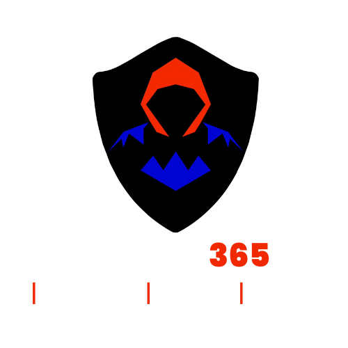

# Welcome to #InfoSec365 Community 👋

## Join our community Github organization 
You can join The InfoSec365 Community by creating a pull request to join our organization.

- ##### innovating somethin' fresh.

- ##### We are building a squad'.

- ##### We do this right, we can change everything!
